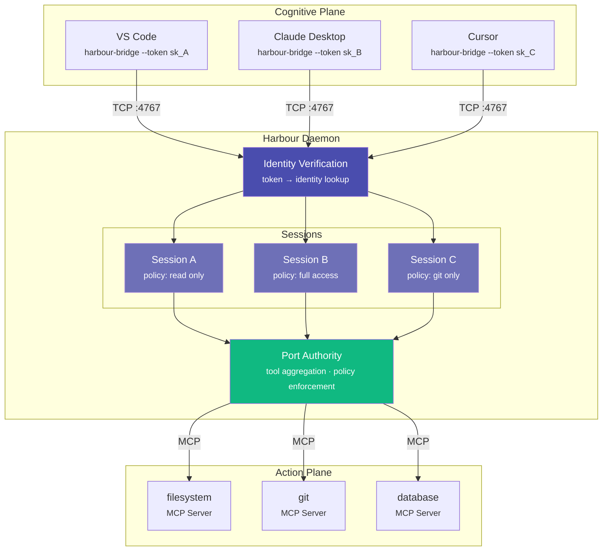
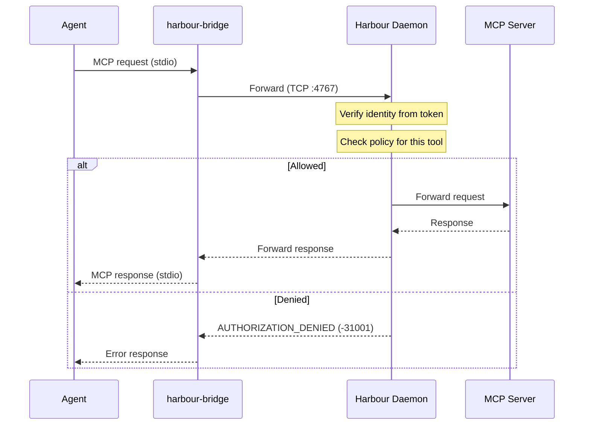

## Overview

MCP Harbour is the port authority for your MCP servers. It aggregates multiple servers into a single endpoint, manages their lifecycle, and enforces per-agent security policies. It implements the [GPARS](https://gpars.io) plane boundary — agents never talk to MCP servers directly.

## System Diagram

## Request Flow

## Entry Points

Two separate commands exist by design:

<CardGroup cols={2}>
  <Card title="harbour" icon="terminal">
    Admin CLI for the user. Manages servers, identities, policies, and the daemon. Belongs to the Action Plane.
  </Card>
  <Card title="harbour-bridge" icon="bridge">
    Lightweight stdio bridge for agents. No admin capabilities. Belongs to the Cognitive Plane.
  </Card>
</CardGroup>

`harbour-bridge` has **no admin capabilities**. The agent cannot manage servers, identities, or policies through it.

## Process Isolation

<CardGroup cols={2}>
  <Card title="Stdio servers" icon="box">
    Spawned per-client. Each agent connection gets its own server process. Full isolation between sessions.
  </Card>
  <Card title="Streamable HTTP servers" icon="globe">
    Shared across clients. The harbour connects to an already-running HTTP server.
  </Card>
</CardGroup>

## Connection Flow

<Steps>
  <Step title="Bridge connects">
    `harbour-bridge` opens a TCP connection to the daemon on port 4767.
  </Step>
  <Step title="Handshake">
    Bridge sends `{"auth": "harbour_sk_..."}`. The daemon derives the identity by checking the token against stored hashes. The agent cannot self-declare its identity.
  </Step>
  <Step title="Session created">
    The daemon loads the identity's policy, spawns per-client MCP server processes, and builds a tool→server cache.
  </Step>
  <Step title="MCP traffic flows">
    Standard JSON-RPC MCP traffic flows through the harbour. Every `call_tool` is checked against the policy before forwarding.
  </Step>
</Steps>

## GPARS Alignment

| GPARS Concept | MCP Harbour |
|---|---|
| Cognitive Plane | Agent + harbour-bridge |
| Action Plane | MCP servers + security policies |
| Plane Boundary | Harbour (port authority) |
| Security Policy | Per-identity policy files |
| `AUTHORIZATION_DENIED` | JSON-RPC error code `-31001` |
| `SERVER_UNAVAILABLE` | JSON-RPC error code `-31002` |
| Identity verification | Token → identity lookup |
| Default deny | No policy = no access |

